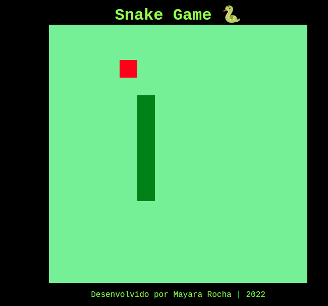

# Snake Game - Recriando o jogo da cobrinha

- Projeto proposto pela [Digital Innovation One](https://digitalinnovation.one/ "Digital Innovation One") aprendendo a desenvolver de forma simples o clássico jogo da cobrinha utilizando HTML, CSS e JavaScript. 

É pura *nostalgia* um jogo divertido e simples em que o objetivo é alimentar a cobra e não aproximar(-se) até tocar em si mesmo se não é **Game Over**!

### Tecnologias Utilizadas:

- HTML5
- CSS
- JavaScript
- Visual Studio Code (editor de texto)

